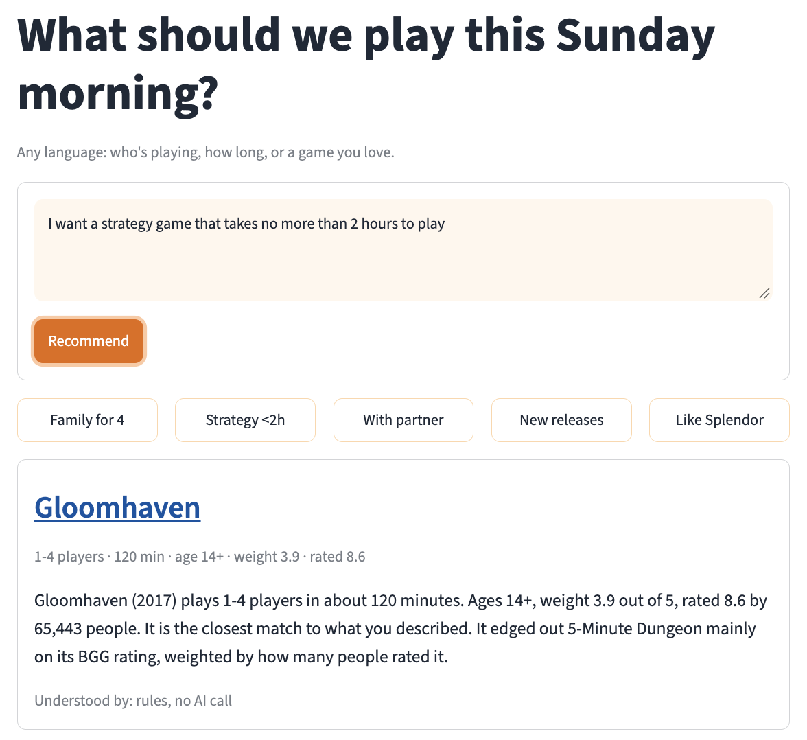
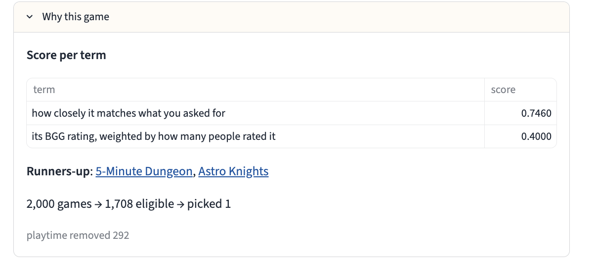
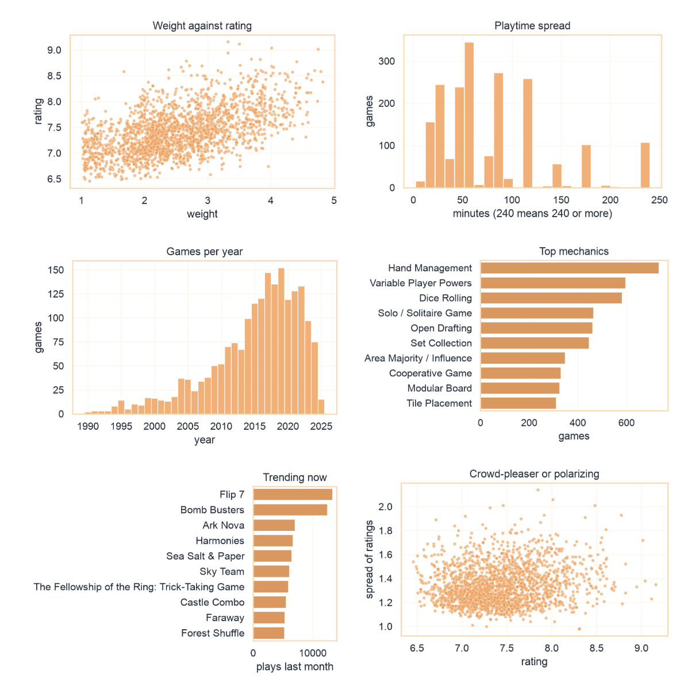
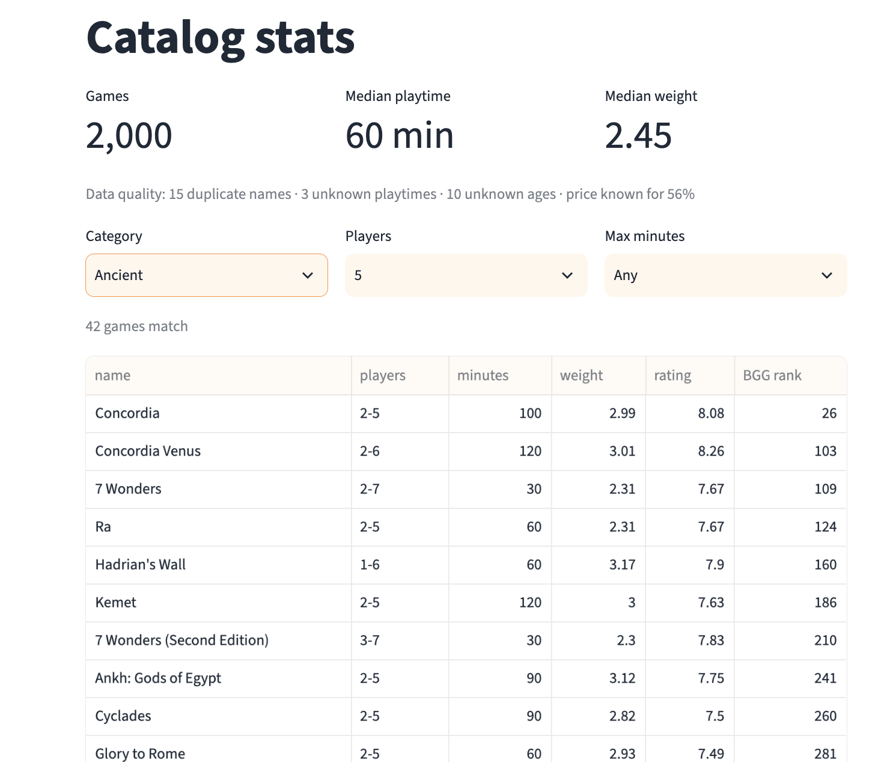
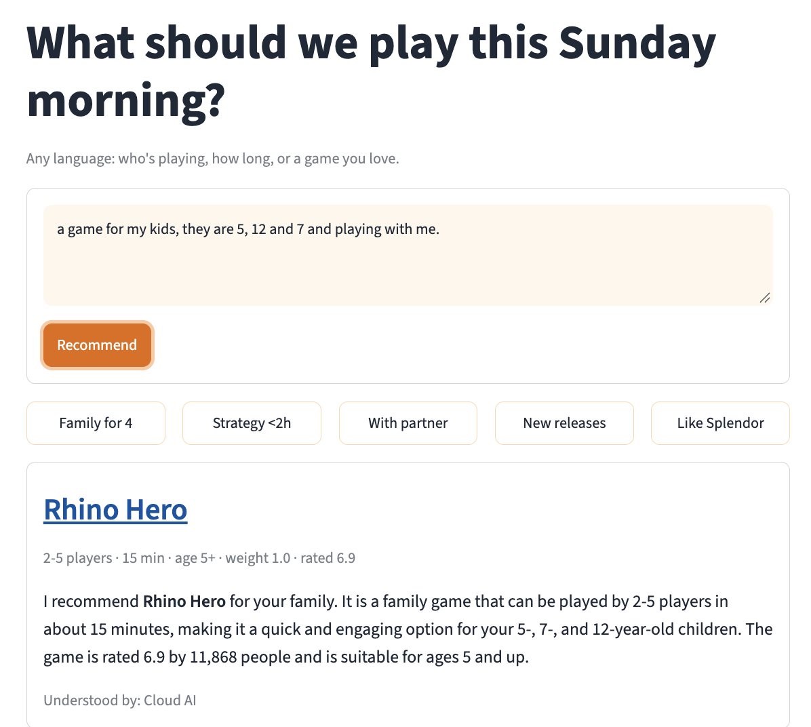
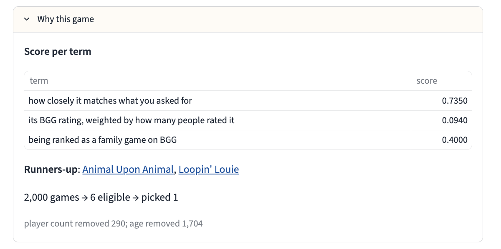
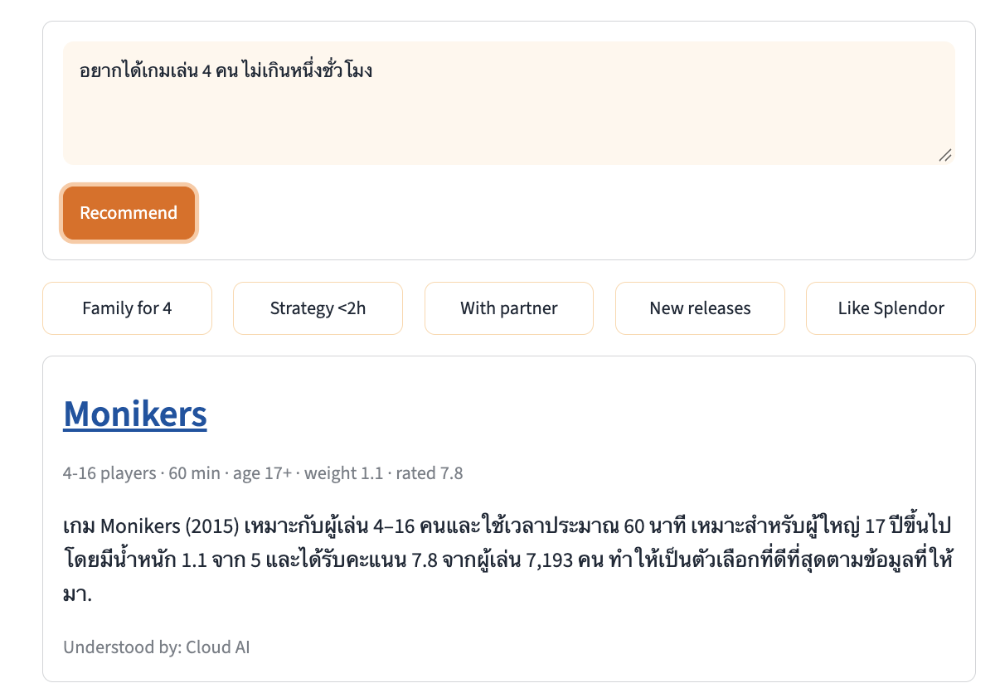
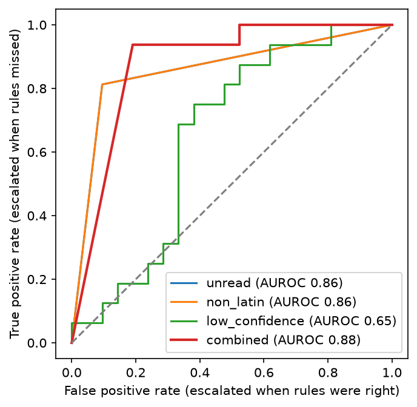
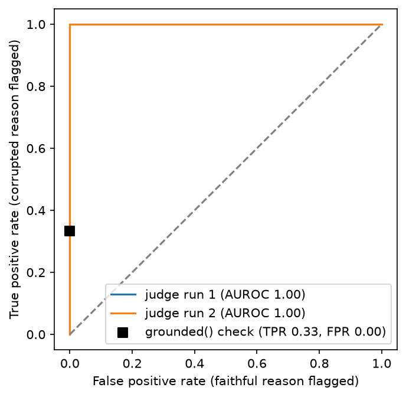

# Board Game Recommendation

Free text in any language, one board game and a reason out, from about 2,000
BoardGameGeek games. Rules and a local multilingual embedding model (int8 ONNX)
answer every request they can read in full, with no network call. Groq is used only
when part of a request is left unread. Player count and age always filter. Only
playtime is relaxed (1.5x, then dropped), and the answer says so.

## Run

```bash
uv run python -m board_game_reco "family game for 4 under an hour"   # CLI
uv run streamlit run app/main.py                                      # app at http://localhost:8501
```

`uv` installs Python 3.12. The first run downloads the model (118 MB).

For other languages and unusual phrasing, paste a Groq key in the app sidebar, or set
`LLM_API_KEY` in `.env` for the CLI. Without a key the service asks a question back
instead of guessing. Queries that need the key:

- `a game for my kids, they are 5, 12 and 7 and playing with me`
- `家族4人で30分くらいで遊べるゲーム`
- `อยากได้เกมเล่น 4 คน ไม่เกินหนึ่งชั่วโมง`

The stats page draws a game map from a one-time build:
`uv run --group map python -m board_game_reco.build`.

Docker (verified on linux/arm64):
`docker buildx build --target runtime -t board-game-reco --load . && docker run --rm -p 8501:8501 board-game-reco`

## Test

```bash
uv run pytest                                        # 248 tests, no key or network needed
uv run python -m evals.run                           # parse, route, recommend, perf
uv run python -m evals.run judge relevance explain   # needs LLM_API_KEY
docker buildx build --target test -t board-game-reco:test --load . \
  && docker run --rm --network none board-game-reco:test test
```

## Results

| Check | Result |
|---|---|
| Unit and gold tests | 248 passed locally, and in the container under `--network none` and `--cpus=2 --memory=2g` |
| Picks that break a stated limit | 0 of the gold recommend rows (constraint satisfaction 1.0) |
| Intent accuracy, test split | 1.0 |
| Field accuracy without a key | English 0.99, Thai 0.78, other languages 0.63 |
| Router (rules or model?) | AUROC 0.88, sends 94% of the requests the rules misread to the model |
| Judge AUROC on corrupted reasons | 1.0 on both runs. The plain `grounded()` check catches 0.33 |
| Mean relevance of the pick (1 to 5) | 3.55 dev, 3.84 test |
| Faithfulness of reasons | Ragas 0.74, grounding check 100% |
| Latency | Basic p95 63 ms on 2 CPUs, cloud p95 1.7 s |
| Cold start, memory, image | 1.9 s, 512 MB peak, 909 MB on disk |
| int8 against fp32, same top pick | 95% (19 of 20) |
| API key in the image | none |

## Pictures

<p>


</p>
<p>


</p>
With a Groq key, the badge reads "Cloud AI". The model reads the request, and the engine
still filters and checks the pick:

<p>


</p>
<p>

</p>

<p>


</p>
